# TP3 - Déploiement avec Kubernetes

## 📋 Informations du projet

- **Étudiant** : Tom Guittet
- **Dépôt GitHub** : [https://github.com/tomguittet/ingnum](https://github.com/tomguittet/ingnum)
- **Images Docker** :
  - RentalService (Java) : `tomguittet/rentalservice-tom`
  - PHP Microservice : `tomguittet/php-microservice`

---

## 🎯 Objectif du TP

Ce TP consiste à déployer une application Docker existante sur un cluster Kubernetes local en utilisant **Minikube**. L'objectif est de créer un **Deployment** avec 2 réplicas et un **Service** de type NodePort pour exposer l'application.

---

## 1️⃣ Installation de l'environnement Kubernetes

### 1.1 Installation de kubectl

kubectl est l'outil en ligne de commande pour interagir avec les clusters Kubernetes.

**Commande utilisée** :
```bash
kubectl version --client
```

**Résultat** :

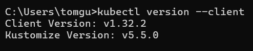

✅ **kubectl v1.32.2** installé avec succès

---

### 1.2 Installation de Minikube

Minikube permet de créer un cluster Kubernetes local pour le développement et les tests.

**Commande utilisée** :
```bash
minikube version
```

**Résultat** :

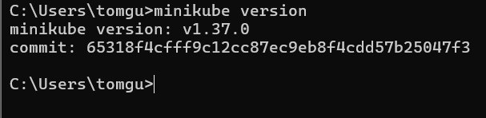

✅ **Minikube v1.37.0** installé avec succès

---

## 2️⃣ Démarrage du cluster Kubernetes

### 2.1 Lancement de Minikube

**Commande utilisée** :
```bash
minikube start --driver=docker
```

### 2.2 Vérification du cluster

**Commande utilisée** :
```bash
kubectl get nodes
```

**Résultat** :

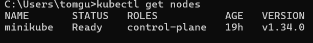

✅ Le node **minikube** est **Ready** et opérationnel

---

## 3️⃣ Création du Deployment Kubernetes

### 3.1 Fichier deployment.yaml

J'ai créé un fichier `deployment.yaml` dans le dossier `kubernetes/` :

```yaml
apiVersion: apps/v1
kind: Deployment
metadata:
  name: rentalservice-deployment
spec:
  replicas: 2
  selector:
    matchLabels:
      app: rentalservice
  template:
    metadata:
      labels:
        app: rentalservice
    spec:
      containers:
      - name: rentalservice
        image: tomguittet/rentalservice-tom:latest
        ports:
        - containerPort: 8080
```

**Explications** :
- `replicas: 2` → Création de 2 instances (pods) de l'application
- `image: tomguittet/rentalservice-tom:latest` → Utilisation de mon image Docker Hub
- `containerPort: 8080` → Port exposé par l'application Spring Boot

### 3.2 Application du déploiement

**Commande utilisée** :
```bash
kubectl apply -f deployment.yaml
```

**Résultat** :

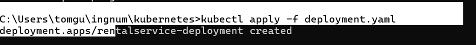

✅ Deployment créé avec succès

### 3.3 Vérification du déploiement

**Commande utilisée** :
```bash
kubectl get deployments
```

**Résultat** :


✅ Le deployment affiche **2/2 READY**, les 2 réplicas sont opérationnels

---

## 4️⃣ Création du Service Kubernetes

### 4.1 Fichier service.yaml

J'ai créé un fichier `service.yaml` dans le dossier `kubernetes/` :

```yaml
apiVersion: v1
kind: Service
metadata:
  name: rentalservice-service
spec:
  type: NodePort
  selector:
    app: rentalservice
  ports:
  - protocol: TCP
    port: 8080
    targetPort: 8080
    nodePort: 30080
```

**Explications** :
- `type: NodePort` → Expose le service sur un port du node
- `port: 8080` → Port du service
- `targetPort: 8080` → Port du conteneur
- `nodePort: 30080` → Port accessible depuis l'extérieur (30000-32767)

### 4.2 Application du service

**Commande utilisée** :
```bash
kubectl apply -f service.yaml
```

**Résultat** :

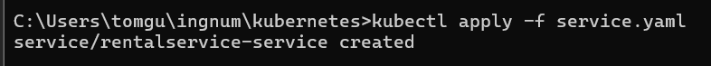

✅ Service créé avec succès

### 4.3 Vérification du service

**Commande utilisée** :
```bash
kubectl get services
```

**Résultat** :

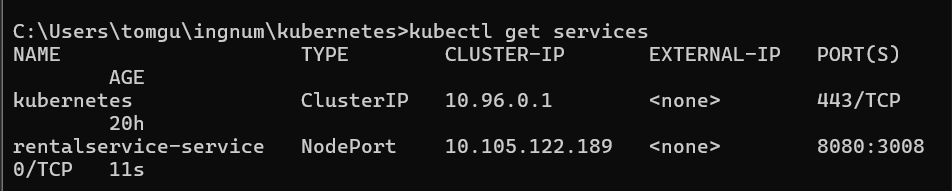

✅ Le service **rentalservice-service** est de type **NodePort** avec le port **8080:30080**

---

## 5️⃣ Test de l'application déployée

### 5.1 Accès au service via Minikube

**Commande utilisée** :
```bash
minikube service rentalservice-service
```

**Résultat** :

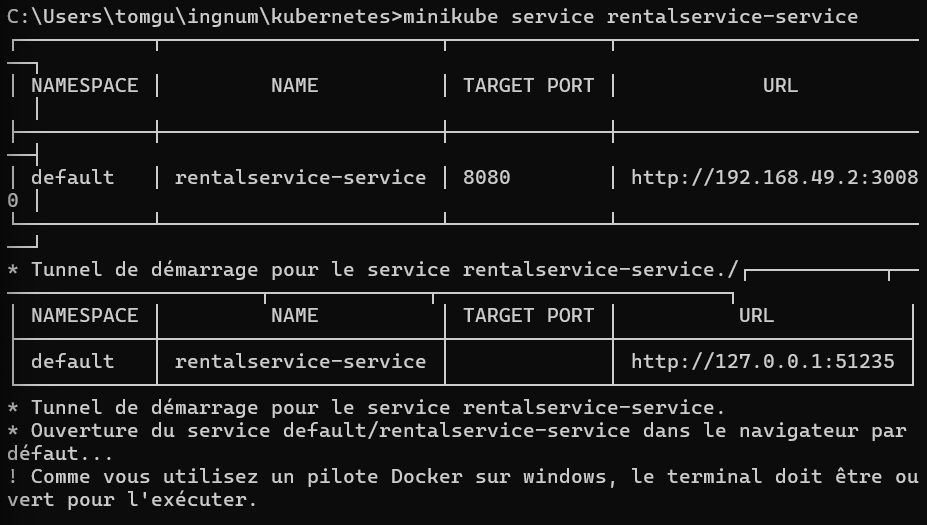

✅ Minikube a créé un tunnel et fourni l'URL d'accès : `http://127.0.0.1:51235`

### 5.2 Vérification dans le navigateur

**URL testée** : `http://127.0.0.1:51235/bonjour`

**Résultat** :

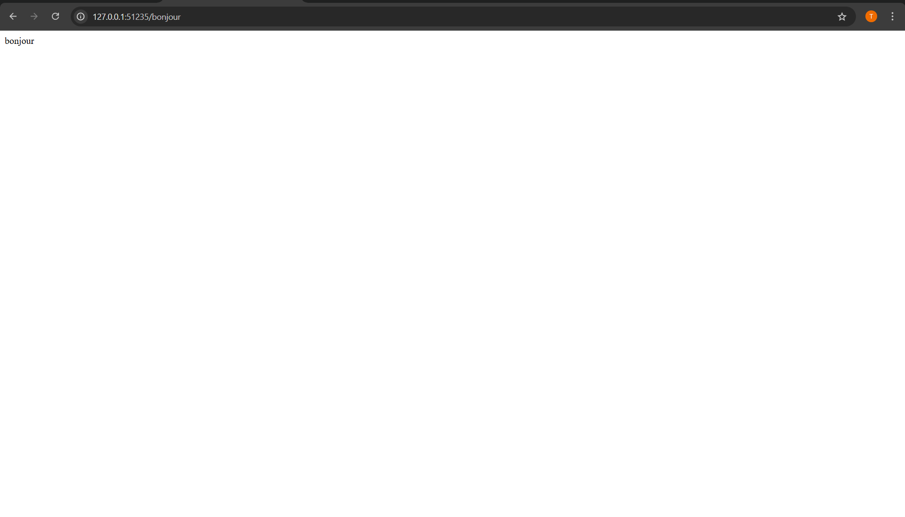

✅ L'application répond correctement avec le message **"bonjour"**

---

## 6️⃣ Analyse détaillée du déploiement

### 6.1 Logs d'un pod

**Commande utilisée** :
```bash
kubectl logs rentalservice-deployment-86b6887887-k8pdms
```

**Résultat** :

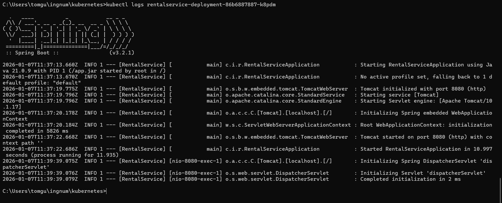

✅ Les logs montrent que l'application Spring Boot a démarré correctement sur le port 8080

### 6.2 État des pods

**Commande utilisée** :
```bash
kubectl get pods
```

**Résultat** :

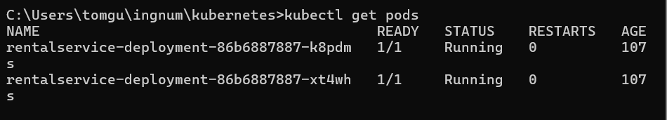

✅ Les 2 pods sont en statut **Running** avec **1/1 READY**

### 6.3 Description détaillée du deployment

**Commande utilisée** :
```bash
kubectl describe deployment rentalservice-deployment
```

**Résultat** :

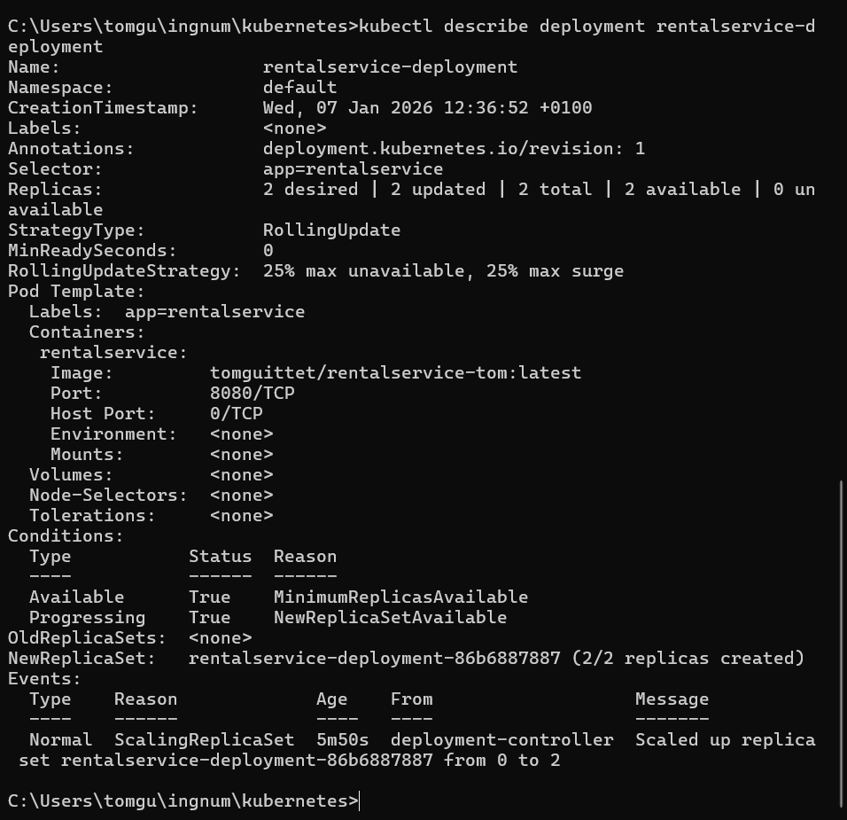

**Informations importantes** :
- **Replicas** : 2 desired | 2 updated | 2 total | 2 available
- **StrategyType** : RollingUpdate (mise à jour progressive)
- **Image** : tomguittet/rentalservice-tom:latest
- **Events** : Scaled up replica set from 0 to 2

✅ Le deployment est parfaitement configuré et opérationnel

---

## 📁 Structure finale du projet

```
ingnum/
│
├── RentalService/
│   ├── src/
│   ├── build/
│   ├── Dockerfile
│   └── ...
│
├── php-microservice/
│   ├── index.php
│   ├── Dockerfile
│   └── ...
│
├── kubernetes/                  
│   ├── deployment.yaml        
│   └── service.yaml            
│
└── README.md/README_tp3.md

```

---

## 🔧 Commandes Kubernetes utiles

| Commande | Description |
|----------|-------------|
| `kubectl get nodes` | Liste les nodes du cluster |
| `kubectl get deployments` | Liste les déploiements |
| `kubectl get pods` | Liste les pods en cours d'exécution |
| `kubectl get services` | Liste les services |
| `kubectl logs <pod-name>` | Affiche les logs d'un pod |
| `kubectl describe deployment <name>` | Détails d'un déploiement |
| `minikube service <service-name>` | Ouvre un service dans le navigateur |
| `minikube stop` | Arrête le cluster |
| `minikube delete` | Supprime le cluster |

---

## 📊 Résultats obtenus

✅ Cluster Kubernetes local créé avec Minikube  
✅ Deployment créé avec 2 réplicas  
✅ Service NodePort configuré sur le port 30080  
✅ Application accessible via navigateur  
✅ Les 2 pods fonctionnent correctement  
✅ Logs applicatifs disponibles  
✅ Fichiers Kubernetes versionnés sur GitHub  

---

## 🎓 Concepts Kubernetes appliqués

1. **Pod** : Unité d'exécution la plus petite dans Kubernetes (conteneur Docker)
2. **Deployment** : Gère les réplicas et les mises à jour des pods
3. **Service** : Expose les pods et fournit un point d'accès stable
4. **NodePort** : Type de service qui expose l'application sur un port du node
5. **Replicas** : Nombre d'instances identiques d'une application

---

## 🚀 Conclusion

Ce TP m'a permis de découvrir les concepts fondamentaux de Kubernetes :
- Création d'un cluster local avec Minikube
- Déploiement d'une application conteneurisée
- Gestion des réplicas pour la haute disponibilité
- Exposition d'un service via NodePort
- Monitoring et debugging avec kubectl

L'application RentalService est maintenant déployée sur Kubernetes avec 2 réplicas, ce qui assure une meilleure disponibilité et résilience.

---

## 📚 Ressources

- [Documentation Kubernetes](https://kubernetes.io/docs/)
- [Documentation Minikube](https://minikube.sigs.k8s.io/docs/)
- [Dépôt de référence du TP](https://github.com/charroux/kubernetes-minikube)

---

**Date de réalisation** : 07/01/2026  
